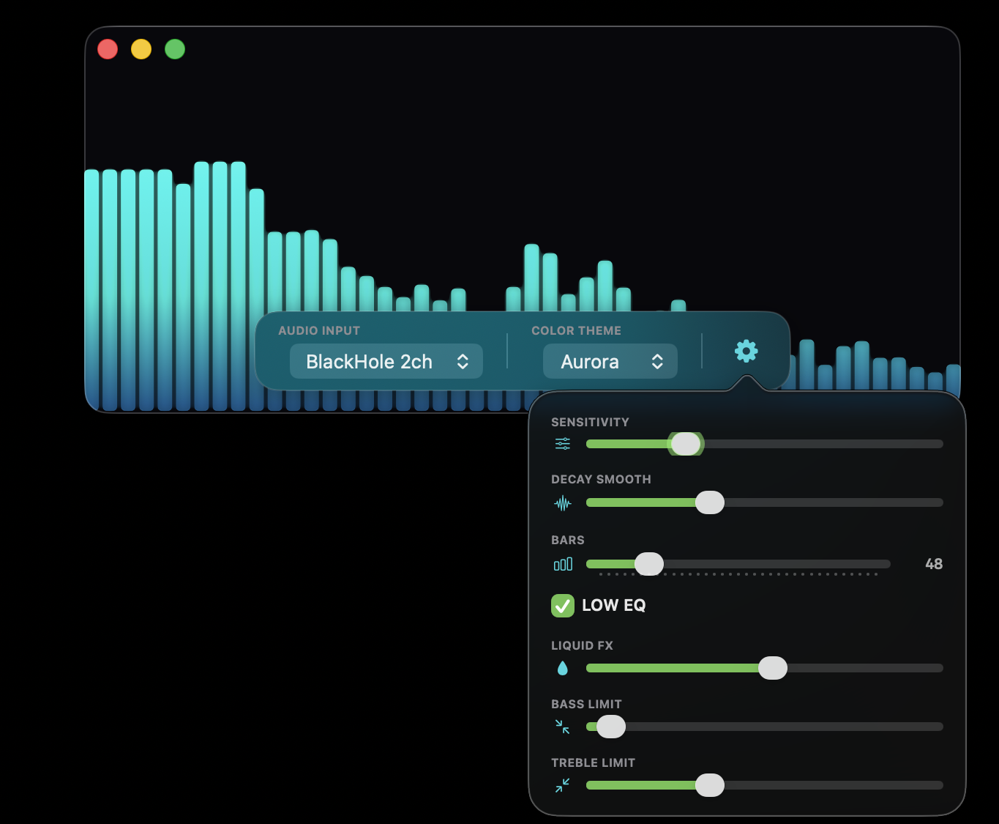
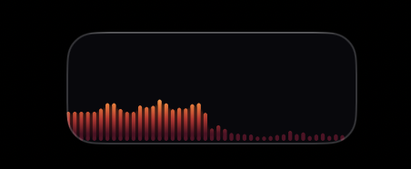
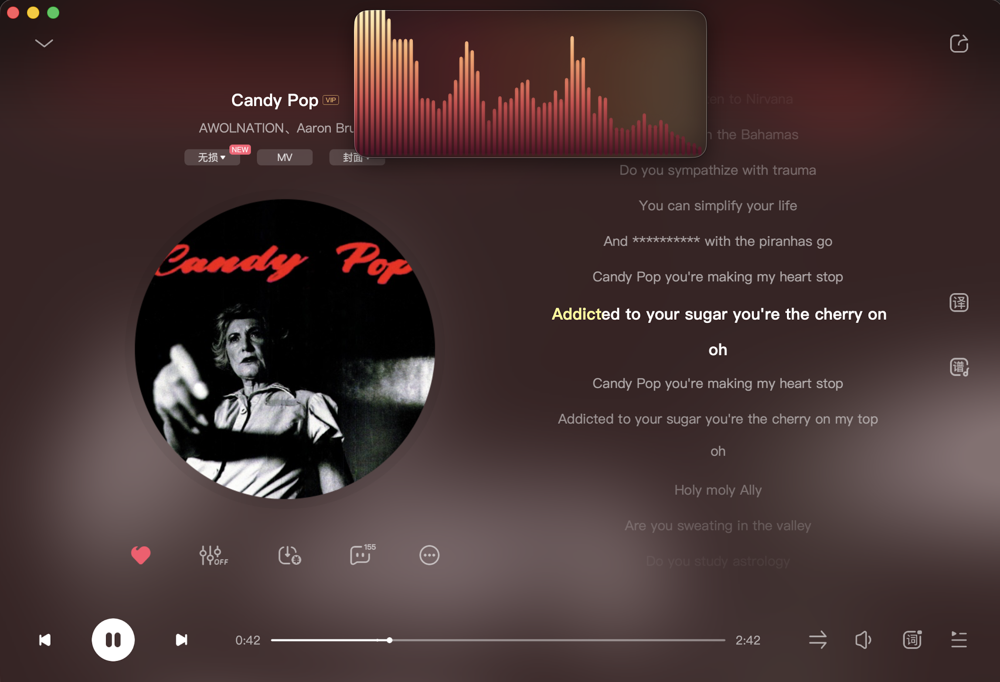

# Wavebar - 原生 macOS 音频频谱可视化器

Wavebar 是一个使用 Swift 和 SwiftUI 开发的高性能、原生 macOS 音频频谱可视化 GUI 应用。它直接通过 CoreAudio 与 AVAudioEngine 捕获系统声音，使用 Accelerate/vDSP 框架进行实时 FFT 频谱分析，采用双线程环形缓冲区设计，并在 SwiftUI Canvas 上利用 VSYNC 硬件帧率同步（支持 ProMotion 120Hz/144Hz）进行极其丝滑的高性能加速渲染。

为了保证极致的视觉观感，Wavebar 采用了高雅的玻璃磨砂设计（Glassmorphism）和高度自适应的动态窗口布局，是您在 macOS 桌面上放置的绝佳 Picture-in-Picture 音乐伴侣。

## 预览







---

## 📖 目录
1. [🔌 环境准备与音频路由 (BlackHole 设置)](#-环境准备与音频路由-blackhole-设置)
2. [🎛️ 操作手册 (User Manual)](#️-操作手册-user-manual)
   - [悬浮控制栏参数详解](#1-悬浮控制栏参数详解)
   - [自适应折叠布局](#2-自适应折叠布局)
   - [桌面融入模式 (Desktop Blend Mode)](#3-桌面融入模式-desktop-blend-mode)
   - [配置持久化与启动布局](#4-配置持久化与启动布局)
3. [💻 二次开发手册 (Developer Guide)](#-二次开发手册-developer-guide)
   - [项目文件结构](#项目文件结构)
   - [核心架构与数据流](#核心架构与数据流)
   - [关键参数与算法调优](#关键参数与算法调优)
4. [🔨 编译与维护命令](#-编译与维护命令)

---

## 🔌 环境准备与音频路由 (BlackHole 设置)

由于 macOS 系统架构的安全限制，应用无法直接从系统的物理扬声器捕获播放的 PCM 音频。为了既能通过耳机或扬声器**听到声音**，又能让 Wavebar **捕获并可视化声音**，我们需要配置一个虚拟音频回环设备（BlackHole 2ch）和多输出设备。

请依次执行以下三个步骤完成配置：

### 步骤 1: 安装 BlackHole 2ch

建议安装 **BlackHole 2ch**（2通道版本，延迟极低，完美适配实时可视化）：
*   打开终端并运行以下 Homebrew 命令：
    ```bash
    brew install blackhole-2ch
    ```
*   *如果您没有安装 Homebrew，也可以前往 BlackHole 官网下载对应的 `.pkg` 安装包进行安装。*

### 步骤 2: 在“音频 MIDI 设置”中创建多输出设备
1. 按下快捷键 `Command + 空格键` 召唤 Spotlight，搜索并打开 macOS 自带的 **音频 MIDI 设置 (Audio MIDI Setup)** App。
2. 在弹出的“音频设备”窗口左下角，点击 **加号 (+)** 按钮。
3. 在下拉菜单中选择 **创建多输出设备 (Create Multi-Output Device)**。
4. 在右侧的设备列表中进行勾选：
   *   **优先勾选** 您的物理播放设备（例如：“内置扬声器”、“External Headphones” 或您的外接音箱/声卡）。
   *   **接着勾选** **BlackHole 2ch**。
   *   *提示：建议物理播放设备排在首位以确保主时钟同步。*
5. 针对 **BlackHole 2ch** 一栏，勾选 **“漂移矫正” (Drift Correction)** 开关，物理播放设备保持不勾选。这能有效保证多设备输出时的音频同步，防止画面与耳朵听到产生时间差或爆音。

### 步骤 3: 将多输出设备设为 macOS 声音主输出
1. 打开 macOS 的 **系统设置 -> 声音 (Sound)**。
2. 在 **输出 (Output)** 设备列表中，选中您刚刚创建的 **多输出设备**（通常名为“多输出设备”）。
3. 此时，系统播放的所有音频都将被同时复制分流到您的耳机/扬声器（让您能听到）以及 BlackHole 2ch 回环通道中（让 Wavebar 能够捕获并可视化）。

### ⚠️ 核心痛点：macOS 多输出设备的音量控制限制与我们的解决方案

在配置完“多输出设备”后，您会遇到一个非常棘手的 macOS 系统设计限制：**系统的音量调节滑块会变灰，键盘上的音量键（F11 / F12）按下时会显示“禁止调节”的灰色禁止符号。**

#### 为什么会这样？
由于多输出设备（在 CoreAudio 底层是 Aggregate Device）由多个物理与虚拟的子输出设备组成（如：您的物理耳机 + 虚拟的 BlackHole），每个子设备的硬件架构和 DB 范围完全不同。macOS 系统在 HAL 层面直接关闭了该多输出主设备的统一音量修改能力，导致用户默认无法通过键盘按键调音量。

#### 传统第三方软件的一刀切硬伤
虽然有些第三方工具能够强行同步调节子设备的音量，但它们采取了“广播式同步”——将所有子设备都设置为相同的绝对音量。
这在配合频谱仪时会带来**灾难性的后果**：

* 如果调小了音量，虚拟声卡 `BlackHole` 的通道输出音量也会被同比例调小，这会导致输入到 Wavebar 的音频信号极其微弱，**所有的频谱柱几乎完全趴在底部无法弹起**。
* 如果为了让频谱条弹得高而将音量拉满，您的物理耳机也会被强行推到 **100% 满额音量，直接震聋耳朵**。

#### 🚀 Wavebar 的独家黑科技：智能音量联动 (VOLUME LINK)

为了完美破局，Wavebar 在设置面板中内置了独家的 **`VOLUME LINK` (智能音量联动)** 引擎：
1. **智能设备过滤与锁死**：当您按下键盘音量键时，Wavebar 会在后台微秒级查询当前输出设备。若检测到多输出设备，它会过滤出所有的虚拟通道（包含 `BlackHole` / `Soundflower` / `Loopback` / `eqMac` 等关键字），**强制将它们的音量锁死在 100% 满额状态（1.0）**，确保频谱分析输入信号永远饱满、灵敏、反应强烈！
2. **物理音量独立微调**：仅对真正的物理输出设备（如您的耳机、外接音响或内置扬声器）进行标准的 1/16 格音量梯度微调。
3. **全局热键拦截与阻断**：Wavebar 拦截并静默处理了系统底层的快捷键事件，完美阻断了 macOS 灰色“禁止音量控制”OSD 弹窗的出现。

#### ⚙️ 如何启用智能音量联动？
1. 点击 Wavebar 悬浮底栏右侧的 **齿轮 (Settings)** 图标打开设置面板。
2. 勾选 **`VOLUME LINK`** 开关。
3. **授予辅助功能权限**：由于拦截全局系统音量热键需要系统级安全授权，应用会提示您前往系统设置。请在弹出的系统面板中，勾选允许 **Wavebar**（这属于 macOS 标准辅助功能热键工具的通用成熟授权，Wavebar 绝不在后台收集或上传任何数据）。
4. 授权完成后，下次启动 Wavebar 它会自动在后台安静激活，彻底告别多输出设备无法调音量的历史！

### 关于麦克风权限与隐私

Wavebar 的目标输入是 **BlackHole** 这类本地虚拟回环设备，不会主动降级读取 Mac 的内置麦克风。macOS 会把 BlackHole 归类到“音频输入”权限体系里，因此以 `.app` 形式运行时可能显示“正在使用麦克风”或请求音频输入权限；这并不表示 Wavebar 在读取物理麦克风，而是系统对所有输入流的统一提示。

Wavebar 全程本地运行，不包含网络请求、上传、遥测或远程服务逻辑。音频样本只在本机内存中进入 FFT/频谱渲染流程，不会写入文件，也不会发送到网络。

---

## 🎛️ 操作手册 (User Manual)

### 1. 悬浮控制栏参数详解

当鼠标悬停在 Wavebar 窗口内时，底部的半透明磨砂控制栏会自动淡入。底栏保留常用的音频输入、配色主题和设置按钮，其余参数集中在设置弹窗中：

| 参数名称 | 控件类型 | 作用与范围 |
| :--- | :--- | :--- |
| **AUDIO INPUT** | 下拉菜单 | 切换 BlackHole 音频捕获源。默认自动优先选中并连接 `"BlackHole 2ch"`；没有 BlackHole 时应用不会启动音频捕获，也不会降级访问麦克风。 |
| **COLOR THEME** | 下拉菜单 | 切换配色主题，提供 4 种精心调配的高端色域：<br>• `Aurora` (极光，深青到薄荷绿)<br>• `Midnight` (午夜，深紫到玫红)<br>• `Sunset` (落日，深红到金黄)<br>• `Silver` (银白，深灰到钛金) |
| **SENSITIVITY** | 滑块 | 灵敏度（`0.3x` ~ `3.0x`）。调整频谱的整体放大增益。在音乐音量较小时可适当调高。 |
| **DECAY SMOOTH** | 滑块 | 平滑衰减速度（`0.03` ~ `0.30`）。滑块越往左，频谱柱起伏越灵敏狂野；越往右，跌落越平缓丝滑。 |
| **BARS** | 滑块 | 频谱柱数量（`24` ~ `160`）。系统自动重算宽度布局，平滑自适应。 |
| **LOW EQ** | 勾选框 | 低频前级均衡增强。开启时，对低音（50Hz-200Hz）应用约 `1.8x` 的前级均衡补偿，中高频呈平滑衰减曲线，使电音、鼓点等低音视觉表现更有冲击力。 |
| **VOLUME LINK** | 勾选框 | **智能音量联动**。开启时，智能拦截系统全局音量热键（F11/F12），在锁死虚拟声卡（如 BlackHole）音量为 100% 以确保频谱灵敏度的前提下，独立调节实际物理耳机的声音，完美解决 macOS 多输出设备键盘无法调音量的硬伤（需要辅助功能授权）。 |
| **DESKTOP BLEND MODE** | 勾选框 | **桌面融入模式**。勾选后，应用会自动隐藏窗口的白色边框和系统阴影，并且窗口背景会变得完全透明，让频谱直接悬浮在壁纸上。当鼠标滑过窗口时，背景与控制栏会自动淡入以供调节，离开后再次淡出。同时采用渐变羽化遮罩（Gradient Mask）处理顶部边缘，彻底消除生硬的边界感，完美融入桌面环境。 |
| **LIQUID FX** | 滑块 | **GPU 液态凝胶渲染强度**（`0.0` ~ `1.0`）。`0` 表示关闭液态叠加，越高越会同时降低融合阈值、扩宽柔边并增强发光，使相邻频谱柱更容易平滑融合成液体化的 Metaball 元球效果。 |
| **BASS LIMIT** | 滑块 | 低音下限（`20Hz` ~ `1000Hz`），可与手势联动。 |
| **TREBLE LIMIT** | 滑块 | 高音上限（`1000Hz` ~ `22000Hz`），可与手势联动。 |

### 2. 自适应折叠布局

为了适配桌面上置顶缩小的极端轻量化场景，Wavebar 实现了布局自动缩减：
*   **控制栏隐藏**：当窗口高度不足 `180` px 或宽度不足 `360` px 时，底部的悬浮控制栏将自动淡出并隐藏，确保画布只显示纯净的频谱起伏。
*   **手势完全保留**：即使控制栏被完全隐藏折叠，画布上的 **水平拖拽缩放与平移手势** 以及 **HUD** 依然保持 100% 激活可用，您依然可以随时随地用鼠标微调分析频段。

### 3. 桌面融入模式 (Desktop Blend Mode)

为了让 Wavebar 完美化身为您 macOS 桌面的一部分（如精致的壁纸小组件），我们在设置面板中引入了独家的 **`DESKTOP BLEND MODE` (桌面融入模式)**。

开启该模式后，应用将启用以下高级融合渲染：
*   **去除窗口痕迹**：立即移除 macOS 系统级的窗口边缘阴影 (`window.hasShadow = false`) 以及 SwiftUI 的白色高亮边框线，实现完全的无界（Borderless）设计。
*   **悬浮无感背景 (Hover-Reactive Transparency)**：
    *   **鼠标移出时**：磨砂黑色背景块完全变为 **100% 透明** (`opacity = 0.0`)，只有五彩缤纷的频谱跳动条和它们的动态霓虹星云发光层直接呈现在您的壁纸上，宛如全息图一般轻盈。
    *   **鼠标滑过时**：磨砂黑色背景块和悬浮控制栏会在 `0.3` 秒内**自动平滑渐变淡入**，让您可以极其方便地进行窗口拖拽（Movable by Window Background）、大小拉伸、切换输入设备或调整细致参数。
*   **羽化遮罩 (Top-Down Gradient Mask)**：顶部边缘采用特殊的对数级渐变羽化遮罩，使得即使在鼠标滑入背景显现时，最上方边缘也会羽化模糊直至完全透明，彻底消除了生硬的几何边界，给视觉体验带来极佳的呼吸感。

### 4. 配置持久化与启动布局

*   **零手动重复**：所有的调节参数（配色主题、灵敏度、平滑度、低频增强、音量联动、频谱柱数、高低音限制频率、音频输入设备、桌面融入模式）均在您修改的瞬间自动通过 `UserDefaults` 完成**立即持久化**，下次打开应用自动加载并恢复先前状态。
*   **智能设备恢复**：音频输入设备通过**设备名称字符串**（而非开机即变的 dynamic CoreAudio 内部 ID）进行持久化，保证重启电脑或拔插外接声卡后依然能完美认出并连回首选输入源。
*   **智能窗口尺寸记忆与防畸形恢复 (Smart Size Restoration)**：应用会在退出或关闭时**自动将当前的窗口尺寸 (Width & Height) 记录下来**（不记忆屏幕上的相对位置，确保每次启动依然居中放置在当前最适宜的主显示器屏幕中）。在下次启动时，应用会智能进行边界安全校验（需满足最窄 160 px、最矮 30 px，且不超过当前显示器的最大可见物理像素分辨率），若数值合法则自适应重置为上一次的个性化比例尺寸；若记录的尺寸存在异常或无任何记录，则自适应退回到默认推荐的 `750x200` px 精准居中尺寸，给用户最省心的智能体验。
*   **一键安全退出**：点击窗口的关闭按钮，整个应用程序进程会彻底干净地退出，不再遗留在系统后台静默消耗资源。

---

## 💻 二次开发手册 (Developer Guide)

Wavebar 在设计上极其注重性能，避免了在音频回调线程中进行内存分配、控制台日志打印和 SwiftUI 状态无效化重绘。

### 项目文件结构

```text
wavebar/
├── Package.swift            # SPM 配置文件，声明 macOS 14+ 平台，排除 AppIcon.icns 资源
├── Makefile                 # 快捷构建工具
├── Sources/
│   ├── main.swift           # 独立可执行程序引导入口，调用 WavebarApp.main()
│   ├── WavebarApp.swift     # SwiftUI App 声明，通过 AppDelegate 提升进程激活级别
│   ├── MainView.swift       # 核心 GUI 视图，使用 Canvas + VSYNC CADisplayLink 驱动极其丝滑的渲染
│   ├── RingBuffer.swift     # 线程安全双端环形缓冲区 (浮点数)
│   ├── AudioEngineManager.swift # 封装 CoreAudio 硬件查询与 AVAudioEngine 输入流 Tap
│   ├── FFTProcessor.swift   # 基于 Accelerate/vDSP 的 FFT 核心处理器
│   ├── SpectrumAnalyzer.swift   # 对数分桶、EQ 曲线、Auto-Gain 与 Attack/Release 动力学分析器
│   └── AppIcon.icns         # 编译后的 native macOS 矢量及多分辨率应用图标
├── script/
│   ├── build_and_run.sh     # 核心打包构建脚本，负责 app 结构拼装、图标资源拷贝与 Info.plist 自动生成
│   ├── ProcessIcon.swift    # 离线图标处理程序，对生成的 PNG 进行智能径向 unblending 与羽化抠图
│   └── generate_icns.sh     # 图标全分辨率生成与打包编译脚本 (调用 sips 与 iconutil)
└── dist/
    └── Wavebar.app          # 构建出的标准 macOS 独立 App Bundle 包 (包含全部图标及 Metallib 资源)```

---

### 核心架构与数据流

整个应用的计算与渲染链路采用**双线程解耦架构**：

```text
【 硬件层: BlackHole 输入设备 】
             │  (实时 PCM Float 采样流)
             ▼
【 实时音频线程: AVAudioEngine Input Tap 】
             │  (零堆分配 Copy，Mono 合流)
             ▼
【 线程安全环形缓冲区: AudioRingBuffer 】
             │  
   ─── 线程隔离边界 (主线程 CADisplayLink VSYNC 硬件同步拉取) ───
             │  
             ▼
【 VSYNC 硬件刷新率对齐事件: CADisplayLink tick 】
             │  (读取最新 1024 样本)
             ├─►【 FFTProcessor (Apply Hann Window -> vDSP Real FFT -> Magnitudes) 】
             │
             ├─►【 SpectrumAnalyzer (对数分桶 -> EQ 增益 -> 自动增益 -> 动力学平滑) 】
             │
             ▼  (更新 @Published smoothedHeights / pulseGlow 状态变量)
【 SwiftUI 渲染层: ZStack / Canvas / Gradient 】
```

1.  **音频捕获（实时高优先级线程）**：
    由 `AVAudioEngine` 的音频捕获总线驱动。回调块在系统实时线程执行，为防止音频断流或爆音，该线程使用预分配的 `downmixBuffer` 进行多通道平均合流（Stereo-to-Mono），并以最快速度写入 `AudioRingBuffer`，**绝不执行堆内存分配、NSLog 输出或任何 SwiftUI 属性更改**。
2.  **频谱处理与渲染（主线程 VSYNC 硬件刷新率驱动）**：
    `MainView.swift` 中声明并使用了硬件时钟对齐的 `CADisplayLink`。当系统屏幕刷新（如 ProMotion 120Hz/144Hz）产生 VSYNC 信号时触发回调，安全地从环形缓冲区拉取最新的 1024 个采样点（相比 2048，分析物理延迟减半至 23ms 左右），通过 `FFTProcessor` 运算并由 `SpectrumAnalyzer` 处理平滑。通过单路径合并批处理（Single-Path Batching）机制在 SwiftUI Canvas 上一笔绘制填充，避免高刷下频繁分配与垃圾回收抖动，呈现极其细腻平滑的视觉动画。

---

### 关键参数与算法调优

若想对可视化效果做更深度的个性化改造，可查阅并修改以下核心代码块：

#### 1. 频域范围与分桶算法 (Logarithmic Binning)
*   **代码位置**：`Sources/SpectrumAnalyzer.swift` -> `regenerateBucketConfigs()`
*   **修改指南**：
    *   分析频段限制在最低 `fMin` (默认 50Hz)，最高 `fMax` (默认 8000Hz) 之间。支持用户在界面上动态拖拽缩放或使用滑块调整（最大支持 `20Hz` ~ `22kHz` 的全频段解析）。
    *   采用对数公式分桶，保证了左侧的低音柱子能够捕获窄至数赫兹的精细能量，防止像线性分桶那样低频全挤在第一个柱子：
        $$\text{fStart} = f_{min} \times \left(\frac{f_{max}}{f_{min}}\right)^{\frac{k}{M}}$$

#### 2. 频段增益与高频声学倾斜补偿 (Equalizer & Spectral Tilt Curve)
*   **代码位置**：`Sources/SpectrumAnalyzer.swift` -> `getEQGain(frequency:)`
*   **修改指南**：
    *   **低频前级均衡增强**：在开启 `LOW EQ` 时，低音（低于 `200Hz`）获得恒定的 **`1.8x`** 前级放大，并在 200Hz - 2000Hz 之间平滑过渡到 1.0x。
    *   **高频声学倾斜补偿 (Spectral Tilt)**：由于音乐信号在物理上符合粉红噪声特性（能量随频率以约 $1/f$ 速度衰减，高频相比低频有 20dB - 30dB 的天然衰减），我们在 200Hz 以上引入了指数倾斜补偿因子 $\text{tilt} = (f / 200)^{0.65}$，以抵消这种天然衰减，使高低频在同一量级上公平竞争：
        *   `200Hz`：无补偿（1.0x）
        *   `1000Hz`：获得约 **`2.85x`** 增益
        *   `4000Hz`：获得约 **`7.0x`** 增益
        *   `8000Hz`：获得约 **`11.0x`** 增益
        *   `16000Hz`：获得约 **`17.3x`** 强力补偿！
    *   这使得清脆的镲片、沙锤等高频乐器能够展现出与低音鼓点同样惊艳的动态高度和响应灵敏度。

#### 3. 动态响应控制 (Dynamics: Attack / Release)
*   **代码位置**：`Sources/SpectrumAnalyzer.swift` -> `processFrame(magnitudes:)`
*   **修改指南**：
    *   `attackCoeff` 提升为 `1.0`（瞬态零延迟冲击，使得节奏爆发更凌厉，柱体反应更加灵敏跟手）。
    *   跌落时采用 `currentRelease`（由滑块绑定的平滑衰减系数，范围 `0.03` 至 `0.30`）。
    *   动力学迭代公式为：
        $$V_{new} = V_{prev} + \text{Coeff} \times (V_{target} - V_{prev})$$

#### 4. 局部与全局混合自适应归一化 (Decoupled Global-Local Normalization & Noise Gate)
*   **代码位置**：`Sources/SpectrumAnalyzer.swift` -> `processFrame(magnitudes:)` 中的归一化与增益计算逻辑。
*   **修改指南**：
    *   **全局自适应上限**：系统维持一个随时间缓慢衰减的全局历史峰值 `runningMax`（每一帧以 `0.006` 的权重融合当前帧的最大幅值，以 `0.994` 的权重融合历史值），用于跟踪音乐的整体宏观动态。
    *   **局部自适应追踪 (`runningMaxes`)**：为了防止重低音的瞬间爆音完全“绑架”整个归一化上限（导致中高频被降维打击至无弹跳状态），我们在后台为每个频段柱维护了专属的 `runningMaxes[k]`，以 `0.008` 的高灵敏度融合率进行局部的微观动态上限追踪。
    *   **局部-全局动态混合**：在实际归一化时，采用 **`45% 全局形状上限 + 55% 局部独立动态`** 进行加权混合：
        $$\text{blendedMax} = (\text{runningMax} \times 0.45) + (\text{localMax} \times 0.55)$$
        这确保了每个频段柱都有自己充足的跃动和呼吸空间，同时保持整个频谱柱落差的宏观艺术轮廓。
    *   **智能局部底噪过滤门限 (Local Noise Gate)**：为了防止没有声音的频段过度拉伸静音白噪声，我们将局部最大值的下限锁定为 `0.01`，彻底根除白噪与设备嘶嘶声，保持极佳的优雅感。

#### 5. 瞬态重低音脉冲检测与比例能量光晕 (Continuous Beat Radial Glow)
*   **代码位置**：`Sources/SpectrumAnalyzer.swift` -> `processFrame(magnitudes:)` 的中段。
*   **修改指南**：
    *   **低音瞬态比计算**：提取 `50Hz` 到 `180Hz` 频段对应的所有桶能量，计算出即时平均值 `bassEnergy`。维护一个平滑基准值 `bassAverage = bassAverage * 0.97 + bassEnergy * 0.03`，并通过 `ratio = bassEnergy / bassAverage` 计算即时低音瞬态能量比。
    *   **连续比例级脉冲强度 (Continuous Proportional Glow)**：摒弃了传统的二元门限硬阈值，改用无级连续的**幂级非线性映射模型**：
        $$\text{pulseGlow} = \max\left(\text{pulseGlow}, \min\left(1.8, \text{excessRatio}^{2.0} \times 1.6 \times \text{energyFactor}\right)\right)$$
        其中，超额瞬态比 `excessRatio = max(0.0, ratio - 1.0)`；低音能量门禁系数 `energyFactor = min(1.0, bassEnergy / 0.02)` 用作自适应降噪。这确保了静音时绝对干净，温柔的轻点鼓声泛起极细腻弱光，而重低音打击乐 Drop 降临时爆发极强张力的 `1.8` 倍高亮闪烁，动态范围大大放大。
    *   `pulseGlow` 随后在每一帧以指数阻尼衰减（`* 0.86`），驱动 MainView 中背景发光层 (`RadialGradient`) 的亮度和大小，实现随节奏起伏的高端律动感。

#### 6. 高频均值/最大值混合映射 (Hybrid HF Mapping)
*   **代码位置**：`Sources/SpectrumAnalyzer.swift` -> `processFrame(magnitudes:)` 的分桶提取阶段。
*   **修改指南**：
    *   **高频细节重塑**：传统分桶在处理高于 `2000Hz` 的高频区（歌手吐字、沙锤、Hi-Hat 镲片）时，一个对数频段通常跨越几十个 FFT 采样点。单纯的“算术平均”会将瞬态高频噪声淹没。
    *   **混合权重机制**：当分析频率大于 `2kHz` 时，算法引入基于频率跨度的插值比例（最高在 $8\text{kHz+}$ 达到 **`85% 最大值 + 15% 均值`** 的高强权重组合，此前为 60%/40%），这让清脆的瞬时高频打击乐信号和金属瞬态摩擦以更极致的瞬态响应脱颖而出。

#### 7. 热辐射超频闪烁 (Emission Flash)
*   **代码位置**：`Sources/MainView.swift` -> `Canvas` 绘制模块。
*   **修改指南**：
    *   应用使用高度优化的 macOS 原生 `Color.blend(with:weight:)` 对渐变色谱进行实时插值渲染。
    *   当重鼓点触发时，利用主线程捕获的比例脉冲 `pulseGlow` 动态影响色彩。频谱条的顶部会按其位置权重，将原本的主题色瞬间混入高亮白色/霓虹色，造成类似白炽热铁在通电冲击下的“超频爆燃闪烁”视觉效果，大大增强了打击乐的眼球反馈。

#### 8. 弹阻共振物理抖动 (Spring-Damped Camera Shake)
*   **代码位置**：`Sources/MainView.swift` -> `DisplayLinkAction` 回调与 Canvas 布局。
*   **修改指南**：
    *   为了打破传统频谱只有柱子在动的单调性，应用在 VSYNC 硬件刷新帧级别引入了标准的 **胡克定律弹簧 - 阻尼器物理系统**（$F = -k \cdot x - c \cdot v$），其中刚度系数 $k=0.16$，阻尼比 $c=0.14$。
    *   当发生振幅大于 `0.9` 的超强鼓点冲击时，给整个画布注入一个向下的瞬时初始速度脉冲 `shakeVelocity = glow * 3.5`。
    *   整个 Canvas 画布（频谱条集合）会因此以极度逼真、紧致的机械感产生下沉和回弹物理颤动，模拟音箱在大音量下震碎空气的震动张力。

---

## 🔨 编译与维护命令

通过项目根目录下的 `Makefile` 可以快速管理全部生命周期：

*   **编译 Release 生产版本**：
    ```bash
    make build
    ```
    *(编译产物将生成至：`dist/Wavebar.app`)*
*   **运行应用**：
    ```bash
    make run
    ```
*   **安装到 Applications**：
    ```bash
    make install
    ```
    *(安装路径：`/Applications/Wavebar.app`)*
*   **清理编译缓存与临时目录**：
    ```bash
    make clean
    ```
